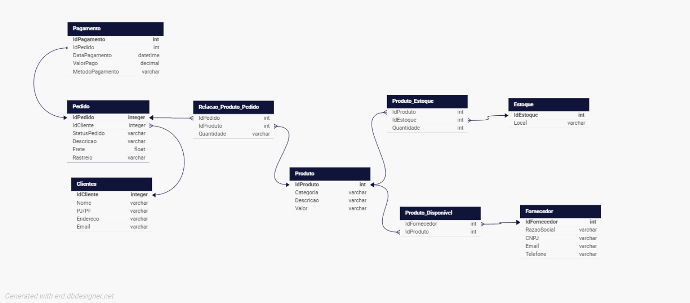

# Projeto Conceitual de Banco de Dados para E-COMMERCE  

Este repositório contém a modelagem conceitual de um banco de dados para uma plataforma de e-commerce. O projeto foi desenvolvido como parte do Curso Suzano - Análise de Dados com Power BI na plataforma DIO, sob a orientação da instrutora Juliana Mascarenhas.  

## 📋 Objetivo  

O objetivo deste projeto é criar um modelo de banco de dados que atenda às principais necessidades de uma plataforma de e-commerce, abrangendo funcionalidades como cadastro de clientes, gerenciamento de produtos, registro de pedidos, processamento de pagamentos e controle de entregas.  

## 🛠️ Ferramentas Utilizadas  

- **Ferramenta de Modelagem**: [DB Designer](https://erd.dbdesigner.net/))  
- **Plataforma de Estudo**: [DIO - Digital Innovation One](https://web.dio.me/)  

## 📖 Estrutura do Banco de Dados  

O modelo conceitual inclui as seguintes entidades principais:  

1. **Cliente**  
   - Dados pessoais (CPF ou CNPJ, endereço, email, etc.)  
   - Tipos: Pessoa Física ou Pessoa Jurídica  

2. **Produto**  
   - Categoria, descrição, valor  

3. **Pedido**  
   - Contém um ou mais produtos  
   - Status do pedido, descrição, frete, rastreio, data do pedido e data de envio

4. **Pagamento**  
   - Formas de pagamento: cartão de crédito, boleto, etc.  
   - Pode estar vinculado a mais de um pedido  

  
*Exemplo do diagrama conceitual*  

## 🚀 Como Visualizar o Modelo  

1. Link: [DB Designer- E-commerceBD](https://dbdesigner.page.link/VqsNA4M9xEoqfoQc7)
3. Explore o modelo conceitual e suas relações.  

## 📝 Licença  

Este projeto está sob a licença MIT. Consulte o arquivo [LICENSE](LICENSE) para mais detalhes.  

## 📚 Referências  

- [DIO - Digital Innovation One](https://web.dio.me/)  
- Curso Suzano - Análise de Dados com Power BI
---

**Desenvolvido por Camila Mota**  
Se tiver dúvidas ou sugestões, entre em contato!  

